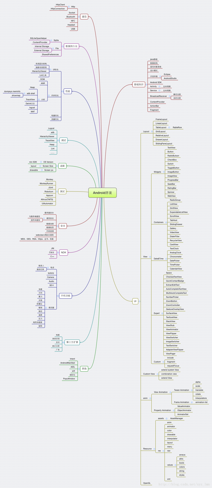

# Android Explore

### 基础篇

####[Activity](./android_activity.md)

####[Service](./android_service.md)

####[View](./android_view.md)

* [Fragment](./android_fragment.md)

* [ListView](./android_listview.md)

* [RecyclerView](http://antonioleiva.com/recyclerview-listener/)

* [Bitmap](./android_view_bitmap.md)

* [ImageView](./android_view_imageview.md)

* [ViewStub](./android_viewstub.md)

* [AndroidCircularSeekBar](https://github.com/RaghavSood/AndroidCircularSeekBar)

* [软键盘](./android_keyboard.md)

* [Toast](./android_toast.md)

* [UI专题](http://dev.10086.cn/cmdn/bbs/viewthread.php?tid=18736&page=1#pid89255)

* TextView

  [获取TextView显示的字符串宽度](http://2kpurple.github.io/2014/11/02/get-text-view-text-width/)

####[Application](./android_application.md)

[Reflection](./android_2_reflection.md)

### 进阶篇

####[插件化](./android_pulgin.md)

#####[Android 6.0 动态权限介绍](./android_systempermissions.md)

##### [视频播放相关](https://github.com/danylovolokh/VideoPlayerManager)

[数据格式处理](./android_2_data.md)

##### WebView
[Android WebView Memory Leak WebView内存泄漏解决方案](http://my.oschina.net/zhibuji/blog/100580)

#### 安全

#### 性能相关
* 内存
  * [基于Android Studio的内存泄漏检测与解决全攻略](http://wetest.qq.com/lab/view/?id=99)
  * [腾讯手机管家实战分析：内存突增是为神马？](http://bugly.qq.com/bbs/forum.php?mod=viewthread&tid=30&highlight=%E5%86%85%E5%AD%98%E7%AA%81%E5%A2%9E)
* 启动速度
* 卡顿
* [如何在Android中避免创建不必要的对象](http://droidyue.com/blog/2016/08/01/avoid-creating-unnecesssary-objects-in-android/?hmsr=toutiao.io&utm_medium=toutiao.io&utm_source=toutiao.io)

### 高级篇

[OpenGL](./android_3_opengl.md)

### [Programmer](./programmer.md)

### 其他

#### 黑科技
[Android卸载监听实现](http://www.jianshu.com/p/189e319a5c45)

[AD SDK](./android_4_ad_sdk.md)

### 开源项目学习
[开源框架Android之史上最全最简单最有用的第三方开源库收集整理，有助于快速开发](http://www.tuicool.com/articles/jyA3MrU/)

[带你学开源项目：OkHttp--自己动手实现okhttp](https://wingjay.com/2016/07/21/%E5%B8%A6%E4%BD%A0%E5%AD%A6%E5%BC%80%E6%BA%90%E9%A1%B9%E7%9B%AE%EF%BC%9AOkHttp-%E8%87%AA%E5%B7%B1%E5%8A%A8%E6%89%8B%E5%AE%9E%E7%8E%B0okhttp/?hmsr=toutiao.io&utm_medium=toutiao.io&utm_source=toutiao.io)

[Fresco](./android_opensource_fresco.md)

[各大公司技术博客](http://asteam.cc/index.php/archives/10/?hmsr=toutiao.io&utm_medium=toutiao.io&utm_source=toutiao.io)

[开源项目学习](./android_source_study.md)

### Y OPEN SOURCE

[YOkHttp](./y_open_source/y_ok_http.md)

### Public

[发布开源库](http://blog.chengdazhi.com/index.php/217?hmsr=toutiao.io&utm_medium=toutiao.io&utm_source=toutiao.io)

###Q&A

Q1:[如何解决65535天花板？](./android_q1.md)

Q2:[一种动态为apk写入信息的方案](http://pingguohe.net/2016/03/21/Dynimac-write-infomation-into-apk.html?hmsr=toutiao.io&utm_medium=toutiao.io&utm_source=toutiao.io)

Q3:[android 定时任务的解决方案](./android_alarm.md)

[From @author 张兴业 http://blog.csdn.net/xyz_lmn](http://blog.csdn.net/xyz_lmn/article/details/41411355)
