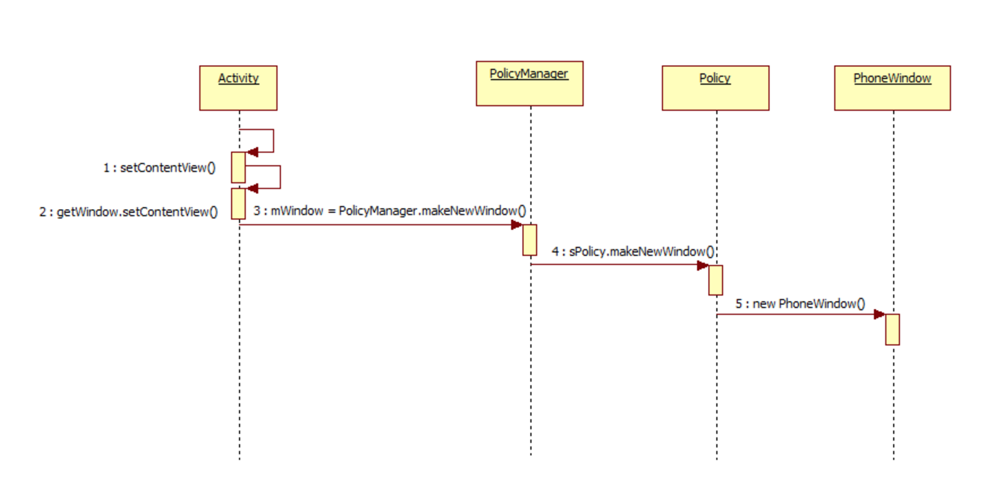

#Something about Android View


Android中加载View是从Activity的OnCreate方法调用setContentView开始。那View的具体加载过程是怎么样的？

追踪一下代码：
####Activity：
```java
    /**
     * Set the activity content from a layout resource.  The resource will be
     * inflated, adding all top-level views to the activity.
     *
     * @param layoutResID Resource ID to be inflated.
     *
     * @see #setContentView(android.view.View)
     * @see #setContentView(android.view.View, android.view.ViewGroup.LayoutParams)
     */
    public void setContentView(int layoutResID) {
        getWindow().setContentView(layoutResID);
        initWindowDecorActionBar();
    }
    
        /**
     * Retrieve the current {@link android.view.Window} for the activity.
     * This can be used to directly access parts of the Window API that
     * are not available through Activity/Screen.
     *
     * @return Window The current window, or null if the activity is not
     *         visual.
     */
    public Window getWindow() {
        return mWindow;
    }
    
```

再找一下mWindow是那里初始化的：

```java
    final void attach(Context context, ....) {
        attachBaseContext(context);

        mFragments.attachActivity(this, mContainer, null);

        mWindow = PolicyManager.makeNewWindow(this);
        
    }

```

Activity在调用onCreate()之前会掉用attach()初始化mWindow,目前先不管attach()是谁调用以及怎么调用，只是分析一下View的加载流程。下面是
####PolicyManager

```java
// sPolicy为Policy对象，实现了接口IPolicy  
    public static Window makeNewWindow(Context context) {  
        return sPolicy.makeNewWindow(context);  
    } 
```

再看看Policy类中的代码

```java
// 这里就是返回了一个PhoneWindow对象  
public PhoneWindow makeNewWindow(Context context) {  
        return new PhoneWindow(context);  
    }  
    
```

从而可知 Activity中的setContentView 最终调用的是PhoneWindow类中的 setContentView. 


```java
@Override  
   public void setContentView(int layoutResID) {  
       if (mContentParent == null) {  
           installDecor();  
       } else {  
           mContentParent.removeAllViews();  
       }  
       mLayoutInflater.inflate(layoutResID, mContentParent);  
       final Callback cb = getCallback();  
       if (cb != null && !isDestroyed()) {  
           cb.onContentChanged();  
       }  
   }  


```

installDecor()初始化了DecorView、mContentParent还有title（3.0以后的ActionBar）。DecorView是继承自FrameLayout的PhoneWindow的内部类。
installDecor()中的代码：

```java
if (mContentParent == null) {  
            mContentParent = generateLayout(mDecor); 
```

再看generateLayout：

```java
protected ViewGroup generateLayout(DecorView decor) {  
  
       View in = mLayoutInflater.inflate(layoutResource, null);  
       decor.addView(in, new ViewGroup.LayoutParams(MATCH_PARENT, MATCH_PARENT));  
  
 }  


```

从上面的代码看出，加载的视图添加到了DecorView上，这样Activitty加载视图的过程就完成了。试图加载过程中出现了Activity、Window、View。

>Activity是Android应用程序的载体，允许用户在其上创建一个用户界面，并提供用户处理事件的API，如onKeyEvent, onTouchEvent等， 并维护应用程序的生命周期。
>
>每一个Activity组件都有一个关联的Window对象，用来描述一个应用程序窗口。每一个应用程序窗口内部又包含有一个View（DecorView）对象，用来描述应用程序窗口的视图。
>
>应用程序窗口视图是真正用来实现UI内容和布局的，也就是说，每一个Activity组件的UI内容和布局都是通过与其所关联的一个Window对象的内部的一个View对象来实现的。




##MORE
[Android 的窗口管理系统 (View, Canvas, WindowManager)](http://www.cnblogs.com/samchen2009/p/3367496.html)

[Android重写view时onAttachedToWindow () 和 onDetachedFromWindow ()](http://blog.csdn.net/eyu8874521/article/details/8493995)

##参考资料
* [张兴业](http://blog.csdn.net/xyz_lmn)   [View的加载过程](http://www.cnblogs.com/xyzlmn/p/3641702.html)
