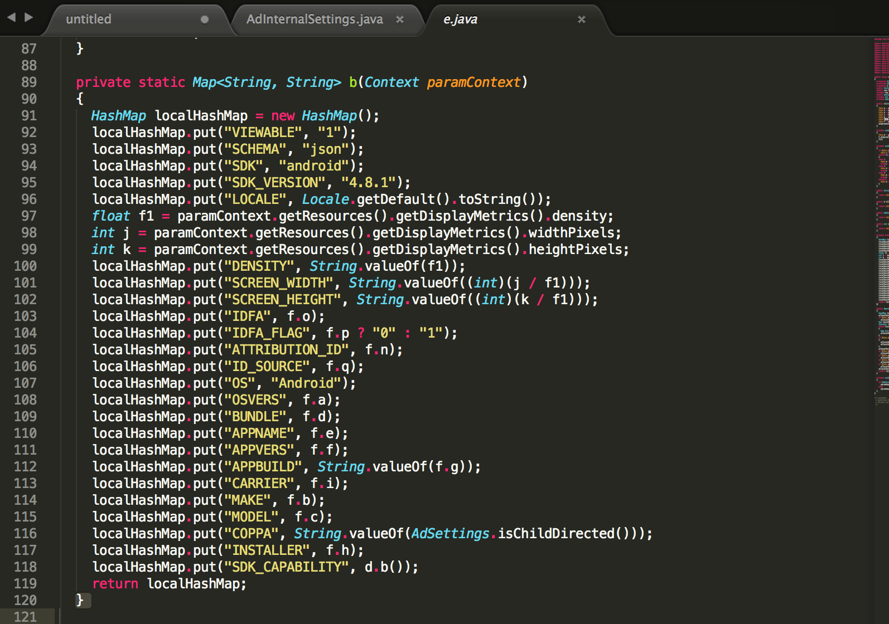
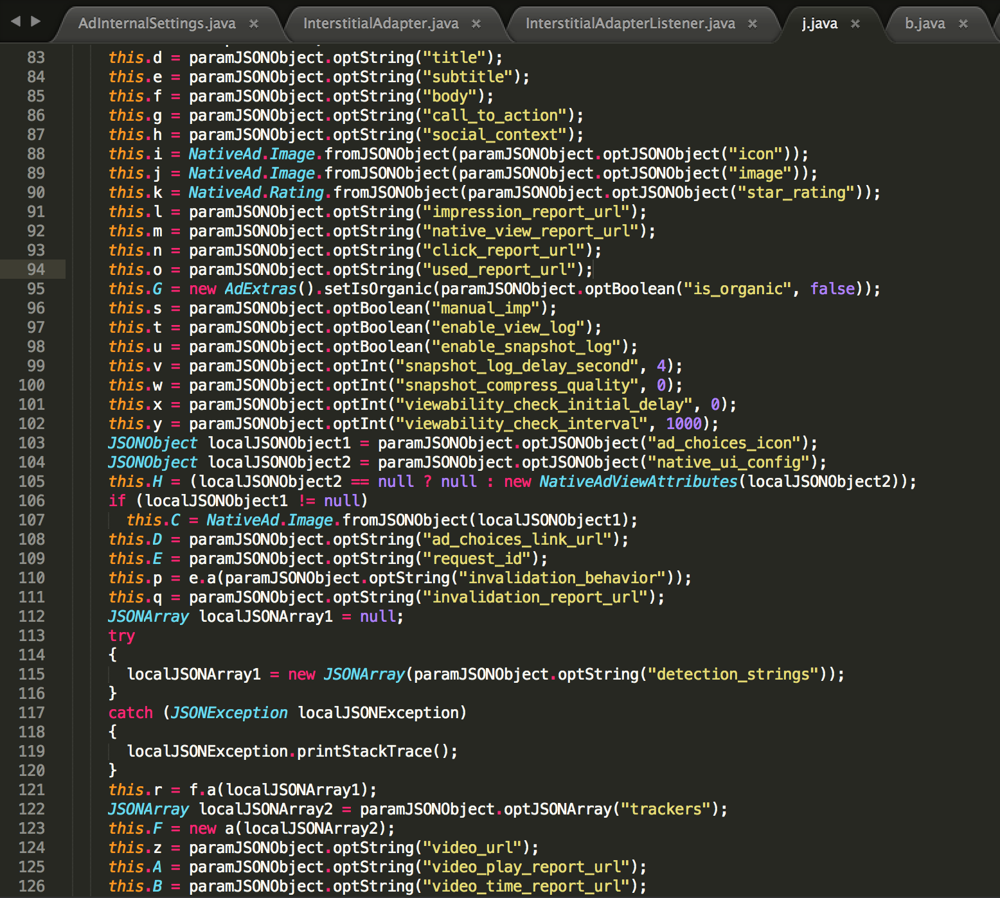
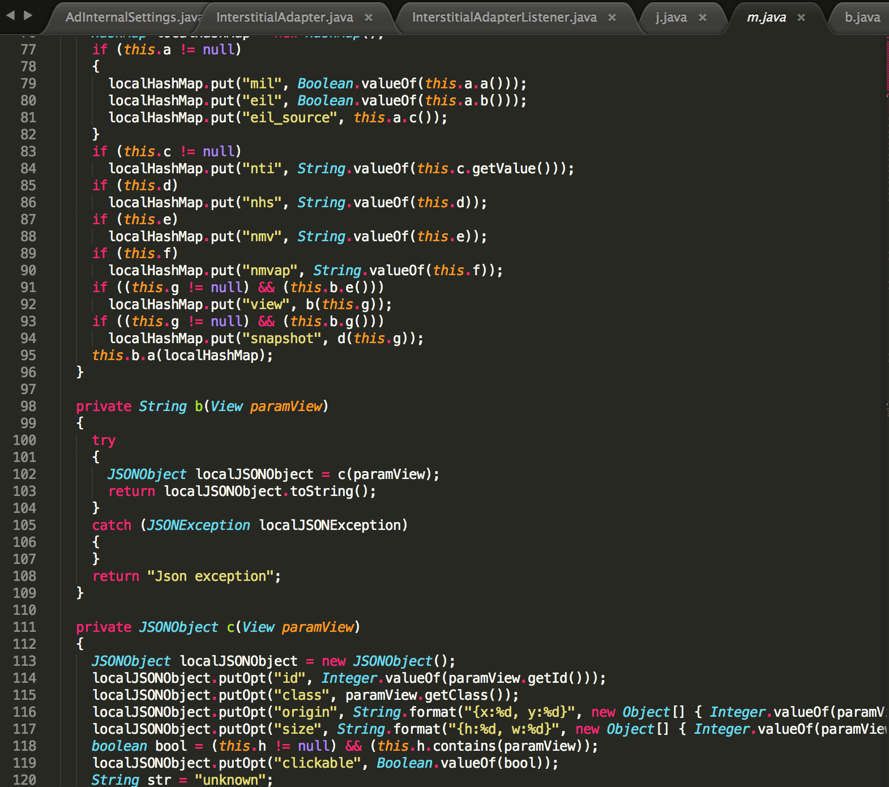

### Facebook广告请求协议研究

初步研究了一下，难免错落之处，欢迎指正讨论。

##### 步骤

1. 下载demo体验；
   1. 需要注册相关的appid和新建广告位才能正常请求广告；
   2. 不想配置广告的话，可以直接开启debug模式体验；
2. 抓包；
   1. 显然，请求用的是Https，无法抓包，Facebook的工程师不是吃素的
3. 反编译Jar包；
   1. 通过跟踪，找到请求协议的相关参数，包括但不限于
      - VIEWABLE 不知道干嘛用
      - SCHEMA 像是数据类型
      - SDK  SDK类型
      - SDK_VERSION SDK版本
      - LOCAL 位置信息
      - DENSTTY 分辨率
      - SCREEN_WIDTH 屏幕宽度
      - SCREEN_HEIGHT 屏幕高度
      - IDFA 未知
      - IDFA_FLAG 位置
      - ATTRIBUTION_ID 未知ID 
      - ID_SOURCE 未知ID
      - OS 手机系统 Android/IOS
      - OSVERS 系统版本
      - BUNDLE 机型信息
      - APPNAME 应用名称
      - APPVERS 应用版本
      - APPBUILD 应用固件
      - CARRIER 未知
      - MAKE 未知
      - MODEL 手机机型信息
      - COPPA 未知
      - INSTALLER 未知
      - SDK_CAPABILITY 未知

请求发起后下发的广告体：

用户操作广告（点击、关闭等）后的数据统计请求参数：

##### 自己实现一个广告SDK要考虑的是？？？

- 平台
  - Android
  - iOS
  - 其他

- 接口协议
  - 请求接口
  - 广告数据
- 网络请求
- 数据缓存
- 易用性，方便接入
- 稳定性
- 内存占用
- 包体大小

- 广告如何什么样形式展示，banner、全屏、视频？
- 广告如何保证投放成功率，如何精准投放？
- 广告如何做到防刷？

##### 市面上那么多广告SDK，一个SDK是否吸引人使用，产生有影响的点

1. 易用性，（注册、嵌入SDK是否方便） 
2. 推广 
3.  广告的丰富性与广告数 
4.  服务 
5. 最重要的收入 
6. 平台的稳定性 

另，补充一下网上摘录的部分移动端广告平台的知识

### Android广告平台介绍

##### 国外的android广告平台

| AD SDK   | 简介                                       | 展示形式                                | 公司       |
| :------- | :--------------------------------------- | ----------------------------------- | -------- |
| Admob    | Admob依靠Google，拥有海量的广告资源，而且Google Play几乎霸占了海外的应用市场份额，因此它在广告界的地位也是无可撼动。 | Banner Ad\InterstitialAd            | Google   |
| Facebook | Facebook Audience Network提供了CPC、CPI、CPM等丰富的广告资源，而且可以根据Facebook的用户的信息进行广告的精准投放，这种精准投放的前提条件也让Facebook广告填充率不够，因为它只能在安装了Facebook的机器上进行广告活动，考虑到国外Facebook的覆盖率，一般来说，Facebook的广告填充率能达到80%－90%。 | Banner  Ad\Native Ad\InterstitialAd | Facebook |

一般只要集成这两家的SDK就可以轻松变现，但是这也存在一些问题，比如：

1.Facebook可以精准投放但是填充率不及Admob，应该怎么优化？

2.两家的广告如果都能填充，如何进行抉择？

​	Admob提供了比较完善的解决方案，那就是SDK集成SDK，你可以在使用Admob SDK时集成Facebook Audience Network，并且可以在Admob后台进行设置，进行广告效果的调优。

##### 广告基本知识

恶补一下广告基本知识： 

* CPM(每千次展示成本)，通过展示获取收益； 
* CPC（每点击成本），通过点击获取收益； 
* CPA（每行动成本），完成下载；安装；激活等方式计算收益 

##### 广告模式

- 广告条：最普遍的广告模式，嵌入在应用界面内，用户点击行为会带来收入。
-  积分墙：应用通过限制功能、去广告等引导用户进入积分墙页面下载广告应用得到积分来换取使用的模式，用户安装完推荐广告软件后开发者才有收入，该模式会被一些市场和发布渠道拒绝应用上架。
-  推送：通过类似短信通知的模式展示广告，此模式用户点击率奇高，所以也是最受市场排挤的模式，像应用汇、安智市场、安卓市场、N多网等等都拒绝发布带推送广告的软件。

##### 市面上广告平台

- 万普平台

  个人开发者觉得最给力的广告平台，广告单价最高，扣量也不多。其主要广告为广告条、积分墙、推送3种模式，主要以CPA广告为主。开发者注册地址：[http://www.waps.cn/?f=zhaostudy3](http://www.waps.cn/?f=zhaostudy3)，数据每1个小时更新一次左右，收入周结算，可以添加多个成员，人均收入低于800每月的，不收任何税费。超过的提现税率为6%。万普的收入明显比其他广告平台高很多、很多...。但是像应用汇、安智市场、安卓市场等大市场都拒绝带万普广告的应用。

- 多盟

  广告条模式，CPC单价0.21元左右，广告填充率很高很高。还算比较靠谱，实时数据、数据每2个小时更新一次左右，收入周结算，可以添加多个成员，人均收入低于800每月的，不收任何税费。超过的部分提现税率为20%。最近多盟系统升级，每次升级后，我的软件广告点击率都大幅下降，2月份点击率为1%，3月份降到了0.5%一下，太黑了，只有我自己统计的40%左右。不过其他广告平台都一样扣量。 

  注册地址:[http://www.domob.cn/](http://www.domob.cn/passport/user/register/recUser/zhaostudy3%40163.com) 

- 腾讯广告

  广告条模式，CPC单价0.1.3元左右，展示和扣量方面都也还可以，每天能查询昨天的数据每月16-20号结算收入，腾讯要收走30%的分成。虽然单价低，但是腾讯的广告都是热门的腾讯软件，点击率很好，我的软件的腾讯广告点击率大概为1.3%。是多盟的2.5倍-3倍的点击率。 

  注册地址:[http://dev.app.qq.com/loginInit.action](http://dev.app.qq.com/loginInit.action) 

- 哇棒（个人感觉：扣量很严重，广告很少，收入奇低）

- 百度联盟
  广告条模式，CPC单价动态计费，所以具体单价未知了，收入还行。百度审核周期很长，而且审核很严格的，经常因各种问题二通不过审核。 注册地址：[http://munion.baidu.com/](http://munion.baidu.com/)

- [小米广告 SDK](http://dev.xiaomi.com/docs/gameentry/%E6%89%8B%E6%9C%BA&pad%E6%B8%B8%E6%88%8F%E6%8E%A5%E5%85%A5%E6%96%87%E6%A1%A3/%E5%B0%8F%E7%B1%B3%E5%B9%BF%E5%91%8ASDK%E9%9B%86%E6%88%90%E6%8C%87%E5%8D%97/)

- 其他：adview,亿动，有米，wooboo,百分通联，万普世纪，芒果，果合，vpon,lense,wiyun,多盟，架势。

  ​

##### 参考

[代码级分析揭秘安卓广告SDK病毒化的事实](http://www.guokr.com/post/335516/)

[移动广告之广告平台选择（Admob&Facebook）](http://leotse90.com/2016/03/22/Mobile-AD-Admob-Integration/)

[Facebook原生广告接入总结](http://blog.csdn.net/figo0423/article/details/46914423)

[IOS Facebook接入](https://yq.aliyun.com/articles/29855)

[facebook sdk接入部分问题和解决方案](http://tjlibaoh.blog.163.com/blog/static/211226413201492922154362/)

[浅析Facebook 广告相关性评分](http://facebookjia.com/facebook-ads/%E6%B5%85%E6%9E%90facebook-%E5%B9%BF%E5%91%8A%E7%9B%B8%E5%85%B3%E6%80%A7%E8%AF%84%E5%88%86)

[Facebook 移动广告投放方式分析](http://facebookjia.com/facebook-ads/facebook-%E7%A7%BB%E5%8A%A8%E5%B9%BF%E5%91%8A%E6%8A%95%E6%94%BE%E6%96%B9%E5%BC%8F%E5%88%86%E6%9E%90)

[Custom Audiences和Lookalike Audiences广告形式浅析](http://facebookjia.com/facebook-ads/custom-audiences%E5%92%8Clookalike-audiences%E5%B9%BF%E5%91%8A%E5%BD%A2%E5%BC%8F%E6%B5%85%E6%9E%90)